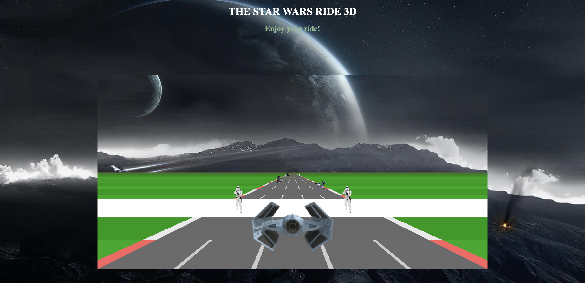
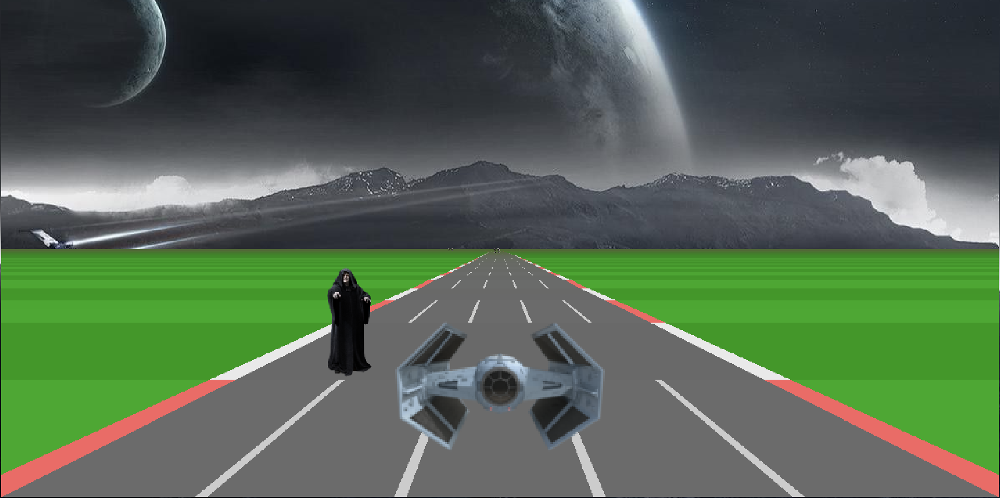
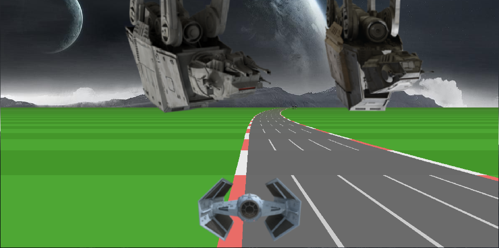

# Game-Development-3D-
Homework assignment for Game Development - A 3D Star Wars riding game!

Meet interesting Star Wars Characters during this journey and ride as far as you can!

Try not to hit the obstacles!

This game is a demo for Phaser 3 made for a homework assignment and it is inspired by the javascript racer built by CodeInComplete: https://codeincomplete.com/posts/javascript-racer/ and the github project: https://github.com/jamessimo/Phaser3-Road

